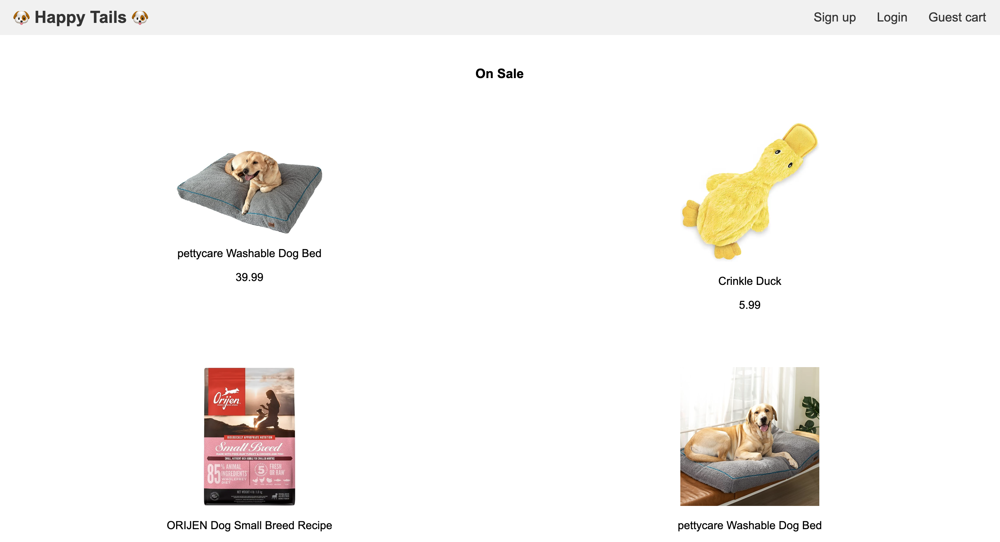
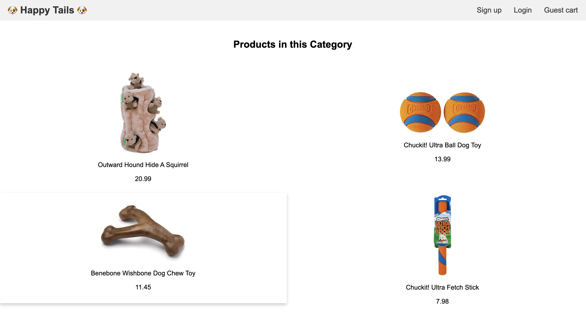
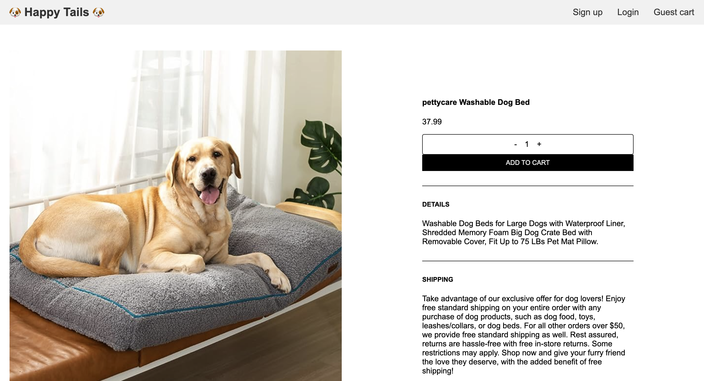
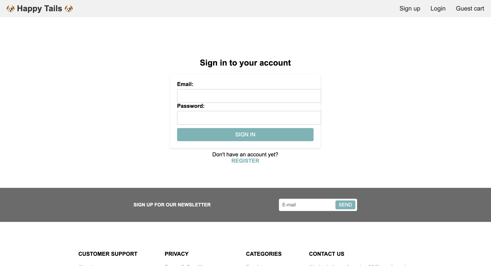
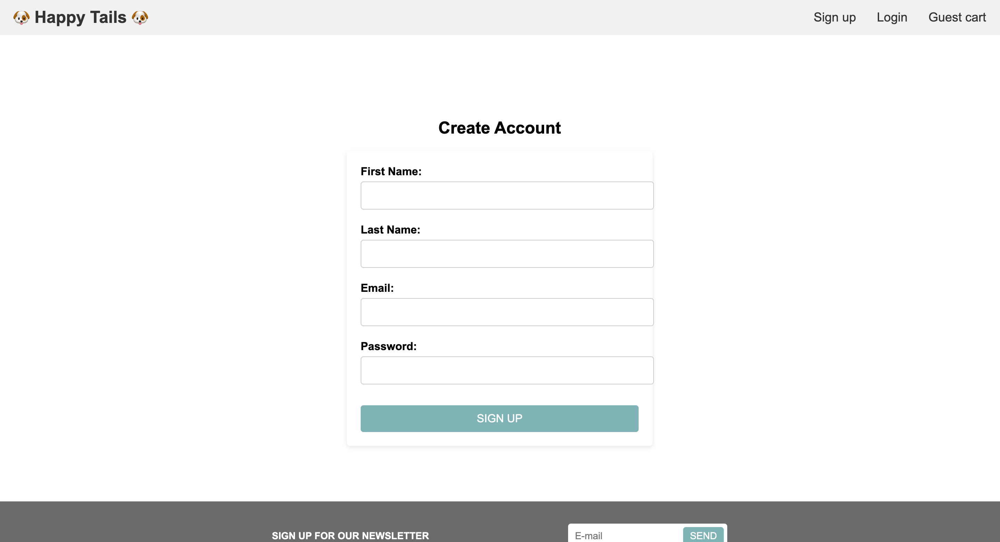

#  Happy Tails Pet Supply Store
  ## Licensing: MIT 

  ## Description
  Welcome to our premier online store dedicated to fulfilling all your dog's needs. We understand the importance of finding the perfect supplies for your canine companion, and our website is designed to provide a convenient and high-quality shopping experience.
  Our website is designed for people who love to shop online for pet supplies for their domestic pets. Customers can choose products by category, on sale status, or new arrival status. Customers are able to create an account and have the option to login and logout. Customers are also able to add or subtract items from their shopping cart.
  
  This project essentially refactors Project #2 but now utilizes the MERN full stack application methods and is fully functional! What is new in this refactored version is that the login and logout feature is completely functional now. Thank you for choosing Happy Tails pet supplies, we hope that our website 
  ## Table of Contents
 

  -[Installation](#installation)
  -[Usage](#usage)
  -[Credits](#credits)
  -[License](#license)  
  -[Tech used](#tech-used)
  -[Questions](#questions)

  ## Website Preview
  
  
  
  
  
  

  ## Links
  - Github repo: https://github.com/cverges1/ecommerce-store-v2
  - Heroku URL:  https://happy-tails-team-d28615ba32fb.herokuapp.com/

  ## Usage
  
  Users will only need a machine with connection to the internet and a list of supplies they might need for their furry friend.
  
  To explore and select products from the e-commerce store, follow these steps:
  1. Access the store using a device with an internet connection.
  2. On the homepage, you will find sections displaying "On Sale" and "New Arrivals." Click on the products in these sections to view their details.
  3. If you have a specific category in mind, navigate to the "Categories" section on the homepage.
   - Click on the "Food" category to view available food products.
   - Click on the "Leashes" category to explore different leash options.
   - Click on the "Beds" category to browse through various pet beds.
   - Click on the "Toys" category to discover a range of entertaining toys for your furry friend.
  4. Review the product information, including descriptions, images, and pricing.
  5. Once you have decided on a product, click on it to view more details.
  6. To make a purchase, note down the desired product(s) and visit a physical store or use alternative purchasing methods. 
 

Please note that the current version of the e-commerce store does not include a functional "Add to Cart" feature. The purpose of the store is to showcase the available products and provide information to users.

  ## Tech used
* JavaScript
* Node.JS
* Express.js
* Google Analytics
* HTML
* CSS
* MongoDB
* React 
* Mongoose ODM
* Heroku
* GraphQL
* Queries and Mutations

## Credits
Collaborators:
* Chris Verges (Github: <a href="https://github.com/cverges1" target="_blank">cverges1 </a>)
* Connor Grogan (Github: <a href="https://github.com/connorg45" target="_blank">connorg45 </a>)
* Abelardo Lugo  (Github: <a href="https://github.com/alugo0823" target="_blank">alugo0823</a>)
* Trenton Sallee  (Github: <a href="https://github.com/trentonsallee" target="_blank">trentonsallee</a>)

## Questions
Have any questions or concerns? Here is where you can reach us:
Email addresses: 
* lugo.kse23@gmail.com (Abelardo Lugo)
* 99grogan@gmail.com (Connor Grogan)
* vergeschris@gmail.com (Chris Verges)
* trentonsmiles@gmail.com (Trenton Sallee)
